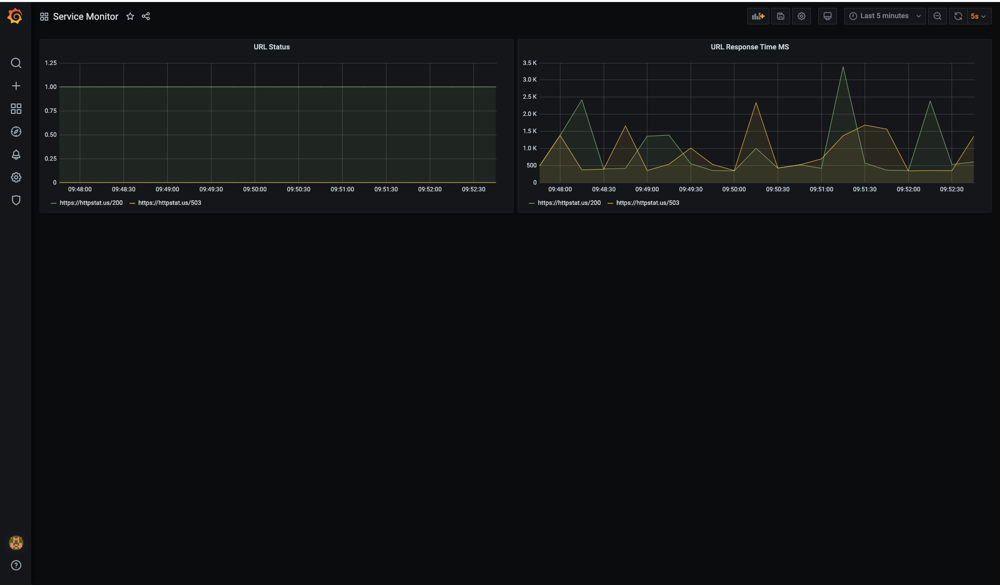
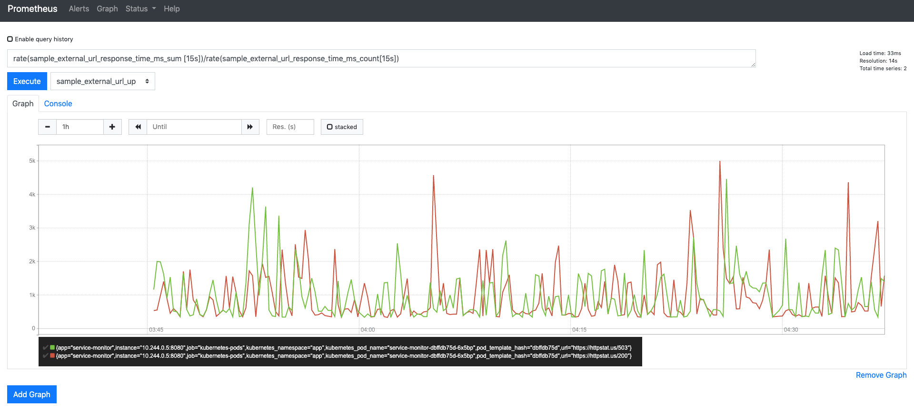
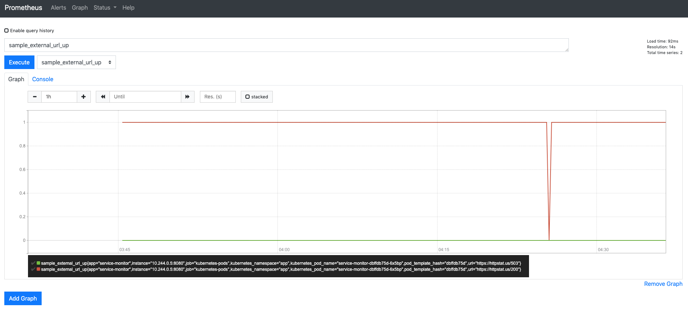
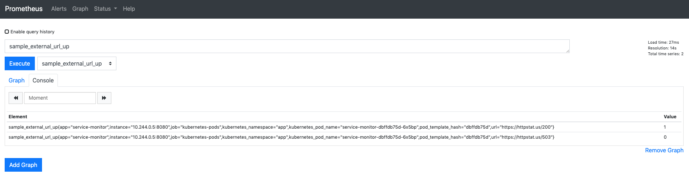
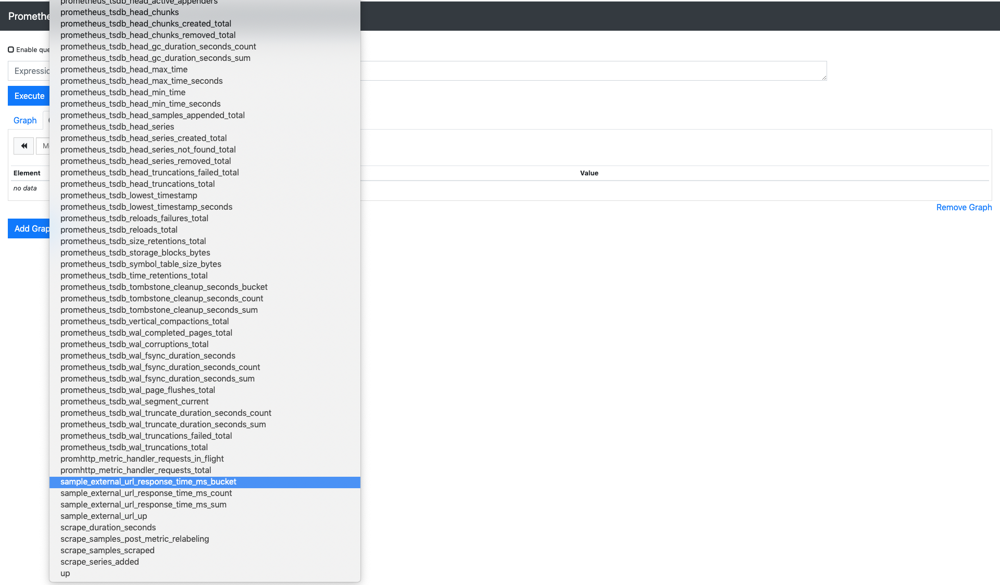
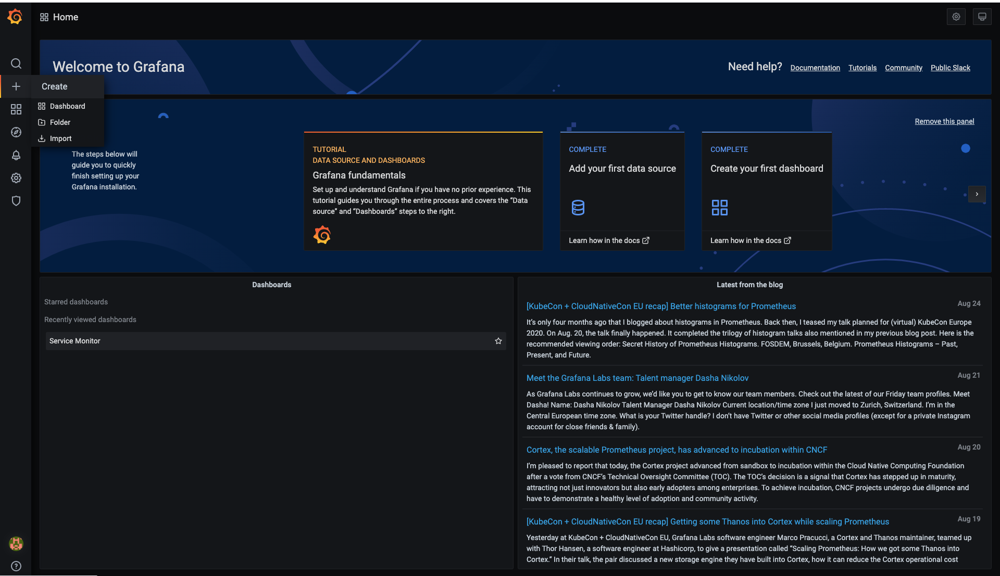
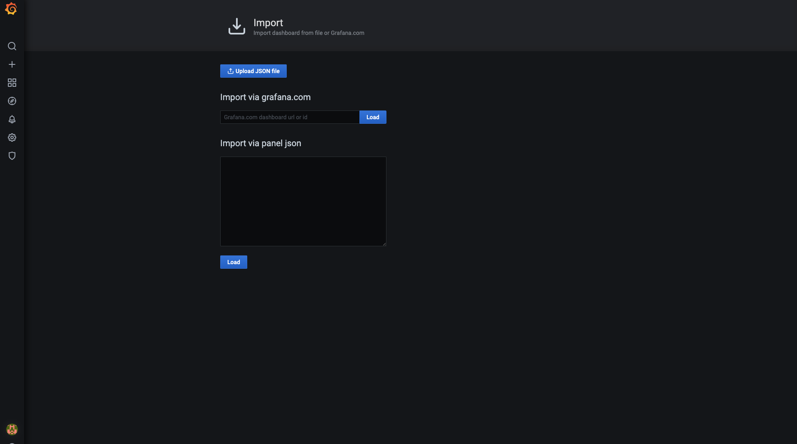

# Service Monitor 
Service monitor is a solution in golang designed to run on a Kubernetes Cluster to monitor internet urls and provide prometheus metrics.

## Assumption
1. Internet URLs not reachable or taking longer that 5 seconds to respond are down.
2. Numbers of URLs to monitor are relatively small and can be passed as configuration to the application.

## Application Screenshot

### Grafana Dashboard



### Prometheus Metrics

##### Screenshot 1


##### Screenshot 2


##### Screenshot 3


##### Screenshot 4


## Deployment and Testing

This application can be deployed on any kubenerets cluster. You can use something like `kind` or `k3d` to deploy and test this application on local system. `kubectl` is also required to interact with your kubernetes cluser.

Please make sure you have following installed, before you proceed to next steps. 
1. `kind` or `k3d`
2. `kubectl`

### Create a new local kubernetes cluster 
  a. To create a cluster with kind 
    ```
    kind create cluster
    ```
  b. To create a cluster with k3d
    ```
    k3d create 
    ```
 Note : Follow the guides printed by above commands to export `KUBE_CONFIG` and tets the cluster.
 

### Clone this repository and change to service_monitor directory 
```
git clone https://www.github.com/viveksyngh/service_monitor.git && cd service_monitor
```

### Create the kubernetes namespace required for the application 
```
kubectl apply -f namespace.yml
```

### Apply the artifacts required to run the application 
```
kubectl apply -f ./yaml
```

### Port forward for prometheus and grafana to access it
```
kubectl port-forward -n app svc/grafana 3000:3000 &
```

```
kubectl port-forward -n app svc/prometheus 9090:9090 &
```

### Create the grafana dashboard
  1. Go to your browser and access granfana using `http://localhost:3000`
  2. Enter below username and password
         ```
         User     : admin
         Password : admin
         ```
  3. Go to Create -> Import 

  
  
  4. Go to Import via panel json section 
  
  

  5. Copy the JSON data from `dasboard.json` file in service_monitor folder
  
  6. Paste it to Import via panel json section and click on import 


### Prometheus metrics 

To view prometheus metrics, please open URL `http://localhost:9090` in your browser


### To build and push you own docker image for service monitor 

  1. Go to `service_monitor` root directory 
  2. Export two variable `NAMESPACE` and `TAG`
     ```
     export NAMESPACE=<you docker registry username>
     export TAG=<TAG for the Image>
     ```
  3. Run below command to build and push 
     ```
     make build && make push
     ```
  Note. Please make sure you are logged in your registry and credentails are saved in docker deamon.
  
  4. Now you can update the `service_monitor` deployment yml to use your docker image and deploy it kubenetes cluster. 
